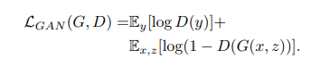
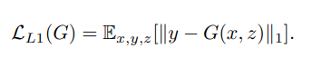

# AI Satellite-to-Map Image Translation with Pix2Pix

This repository implements a Pix2Pix-based Generative Adversarial Network (GAN) to translate satellite imagery into corresponding map images. 

---

## Background & Motivation

**Pix2Pix for Geospatial Data**  
The Pix2Pix architecture uses a conditional GAN to learn a mapping from one image domain (satellite images) to another (map representations). Applications include:
- Generating map overlays on drones or satellites for real-time navigation.
- Simplifying geospatial data visualization for situational awareness.
- Preprocessing data for land-use classification or environmental monitoring.

---

## Key Features

- **Pix2Pix Implementation**: Includes training, inference, and API functionalities.
- **Dataset Preparation**: Automatically download and process geospatial datasets.
- **Mac M1 Support**: Configured to leverage Metal GPU acceleration on Apple M1 chips.

---

## Architecture Overview

### 1. **Generator Architecture**

The Generator uses a U-Net architecture for translating satellite images into maps. Below is a visual representation:


---

### 2. **Loss Functions**

The Pix2Pix model minimizes two key loss components:
- **GAN Loss**: Guides the generator to produce realistic images.
- **L1 Loss**: Encourages similarity between generated and target images.

#### Final Loss Formula:


#### GAN Loss:


#### L1 Loss:


---

### 3. **Sample Input and Output**

Below are examples of input satellite images, corresponding outputs, and expected map targets:

#### Sample Input:


#### Generated Output:


#### Combined Sample (Input | Output | Target):


---

## Prerequisites

- **Hardware**: Apple Mac with M1 (2020) or later, supporting Metal API.
- **OS**: macOS 12 Monterey or later.
- **Python**: Version 3.9 or later.

---

## Installation

1. **Clone the Repository**:
   ```bash
   git clone https://github.com/yourusername/edge-ai-satellite-to-maps.git
   cd edge-ai-satellite-to-maps
   ```

2. **Set Up Python Environment**:
   Create a virtual environment and install dependencies:
   ```bash
   python3 -m venv venv
   source venv/bin/activate
   pip install -r requirements.txt
   ```

   **Mac M1 Note**: Ensure TensorFlow is optimized for Metal API:
   ```bash
   pip install tensorflow-macos tensorflow-metal
   ```

3. **Download the Dataset**:
   Run the dataset download script:
   ```bash
   bash data/download_and_extract_maps.sh
   ```

---

## Creating a New Model from Scratch

Follow these steps to create and train a new Pix2Pix model:

1. **Download and Prepare the Dataset**:
   Run the provided script to download and extract the dataset:
   ```bash
   bash data/download_and_extract_maps.sh
   ```

   After extraction, the dataset will be stored in `data/maps_dataset/maps/` with the following structure:
   ```
   data/maps_dataset/maps/
   ├── train/   # Training images
   └── val/     # Validation images
   ```

2. **Train the Model**:
   Use the `train.py` script to train the model:
   ```bash
   python src/train.py --data_path data/maps_dataset/maps/train --epochs 50 --batch_size 4
   ```

   **Arguments**:
   - `--data_path`: Path to the training dataset.
   - `--epochs`: Number of training epochs (default: 10; recommended: 50).
   - `--batch_size`: Batch size for training (default: 1; M1 GPUs handle up to 4 for 256x256 images).

   Training logs will display loss metrics for the Discriminator (`d1` and `d2`) and Generator (`g`), and progress plots will be generated periodically.

3. **Save and Resume Training**:
   The script periodically saves model checkpoints in the `models/` directory. For example:
   ```
   models/
   ├── discriminator_model_epoch10_d1.123_d2.456_g25.789_2024-12-12_10-15-30.h5
   ├── generator_model_epoch10_d1.123_d2.456_g25.789_2024-12-12_10-15-30.h5
   └── gan_model_epoch10_d1.123_d2.456_g25.789_2024-12-12_10-15-30.h5
   ```

---

## Using the Model

### 1. **Inference**:
Run the `inference.py` script to generate map images from satellite input:
```bash
python src/inference.py --model_path model/model_latest.h5 --input_image path/to/satellite_image.jpg --output_image path/to/output_map.png
```

**Arguments**:
- `--model_path`: Path to the trained generator model.
- `--input_image`: Path to the input satellite image.
- `--output_image`: Path to save the generated map.

---

### 2. **Serve the Model via API**:
Run the Flask API to serve predictions:
```bash
cd api
python app.py
```

**API Endpoint**:
- `POST /predict`  
  Upload a satellite image and retrieve the generated map. Example:
  ```bash
  curl -X POST -F "image=@path/to/satellite_image.jpg" http://127.0.0.1:5000/predict -o output_map.png
  ```

---

## File Structure

```
├── README.md                 # Project documentation
├── api/                      # API for serving predictions
│   ├── __init__.py
│   └── app.py
├── data/                     # Dataset scripts and storage
│   ├── download_and_extract_maps.sh
│   └── maps_dataset
│       ├── train/
│       └── val/
├── model/                    # Trained models
│   └── model_latest.h5
├── resources/                # Images used in documentation
│   ├── final-loss-function-formula.png
│   ├── gan-loss-rename.png
│   ├── generator-architecture.png
│   ├── input.png
│   ├── l1-loss-function.png
│   ├── output.png
│   └── sample.png
├── requirements.txt          # Python dependencies
└── src/                      # Source code for Pix2Pix
    ├── data_preparation.py   # Dataset preparation functions
    ├── inference.py          # Inference script
    ├── models.py             # Pix2Pix model definitions
    ├── train.py              # Training script
    └── utils.py              # Utility functions
```

---

## Tips for Running on Mac M1 GPU

1. **Enable GPU Acceleration**:
   Verify TensorFlow is using Metal API:
   ```python
   from tensorflow.python.framework import test_util
   print(test_util.is_built_with_gpu_support())  # Should print True
   ```

2. **Monitor GPU Usage**:
   Use macOS Activity Monitor to confirm GPU utilization during training.

3. **Optimize Batch Sizes**:
   Reduce the batch size if you encounter memory issues.

---

## References

- [Pix2Pix Paper](https://arxiv.org/abs/1611.07004) - Isola et al., 2017.
- [TensorFlow Metal Plugin](https://developer.apple.com/metal/tensorflow-plugin/) - Apple Developer Documentation.

